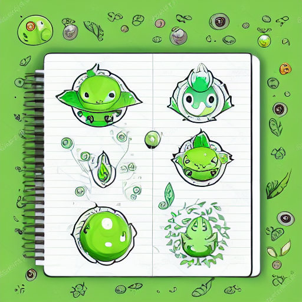
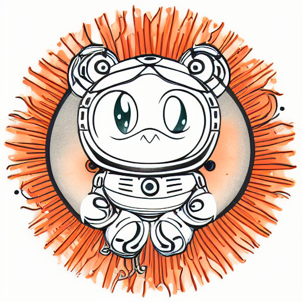
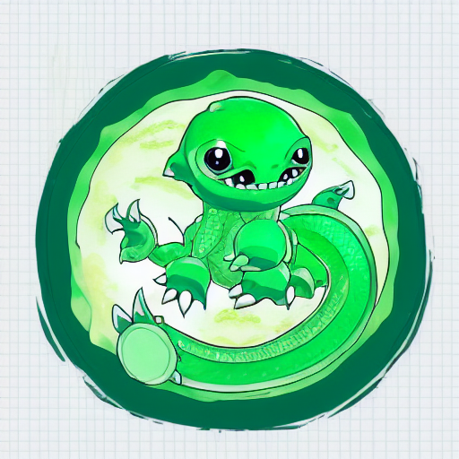

# Notebook Pets · Notebuddy

[한국어](README.md) · **English**

Baseline version: **0.2.0** · Development branch: `develop` · Release branch: `release`

> An AI companion born in a notebook — a monster you care for and raise on Discord.

Notebook Pets is a virtual-pet project where **Python handles the game rules and an AI agent gives the character its voice and story**. Feed your monster, play together, and take walks to build a relationship with your companion.

The repository is named `notebook-pets`; the service name is **Notebuddy (노트버디)**. Older documents also refer to the project as `notebook-monster` or `공책 AI 키우기`.

<p align="center">
  
  
  
</p>

## Project status

**This is a work-in-progress prototype.** The repository includes a game engine, balance data, image-generation tools, and starter artwork. The Hermes profiles and skills used for Discord, and the ComfyUI runtime, must be supplied separately.

A code review on 2026-10-05 identified **progression and time-handling bugs, including missing XP accumulation**. This README describes the current implementation, not a finished end-to-end game. Read [Known limitations and next steps](#known-limitations-and-next-steps) before resuming development.

## Game features

| Area | Contents |
| --- | --- |
| Monsters | 9 species × 8 elements: 72 starter combinations |
| Care | Feeding, snacks, play, sleep, intimacy, and satiety |
| Activities | Training, walks, wild encounters, battles, and capture |
| Records | Battle records, capture collection, titles, and rankings |
| Progression rules | Stage transitions at levels 31, 51, and 81; level cap of 100 |
| Final evolution | Light branch at intimacy 70 or above; dark branch below 70 |
| Artwork | All 72 stage-one combinations, plus ComfyUI generation tools |

Progression rules exist in code and data, but the XP bug currently prevents normal leveling and evolution. There are no prerendered stage-two or stage-three images; one stage-four example is included.

## Architecture and principles

```text
Discord message
    ↓
Hermes agent / routing skill          ← configured outside this repository
    ↓ command and authenticated sender ID
Python game engine
    ├─ reads rules from game_data.json
    ├─ evaluates state, cooldowns, and battles
    └─ writes state/{user_id}.json
    ↓ JSON result
Agent replies in the monster's voice

Image-generation tool → local ComfyUI → PNG file
```

- **Separate rules from expression:** the agent is intended to narrate engine results rather than invent game outcomes.
- **Persist state in files:** per-user JSON, rather than conversational memory, is the source of game state.
- **Keep balance in data:** species, elements, matchups, XP thresholds, and action limits live in `data/game_data.json`.
- **Speak as the character:** the connected agent provides the monster's first-person persona. That configuration is not included here.

The engine is **rule-based and uses randomness**. Older references to a “deterministic engine” mean that the LLM does not adjudicate game rules; they do not imply identical outcomes for identical inputs or tamper-proof execution.

## Quick start

### Requirements

- Python 3. The reviewed environment uses Python 3.12; a minimum supported version has not been verified.
- The engine and current tests use only the Python standard library. No `pip install` is needed for this path.
- Discord, Hermes, ComfyUI, and LLM API keys are not required to try the basic CLI.

Run these commands from the repository root:

```bash
git clone --branch develop https://github.com/kdkrkwhr/notebook-pets.git
cd notebook-pets

# Help takes no user ID
python -X utf8 engine/engine.py help

# Creates a demo save at state/123456789012345678.json
python -X utf8 engine/engine.py 123456789012345678 start Buddy
python -X utf8 engine/engine.py 123456789012345678 status
python -X utf8 engine/engine.py 123456789012345678 밥줘
python -X utf8 engine/engine.py 123456789012345678 walk

# Rankings also take no user ID
python -X utf8 engine/engine.py rank
```

Starting again with the same ID returns an existing-monster response. These commands create and modify a save file, so use a demo ID distinct from real users. Avoid running commands or the decay batch concurrently against the same user.

Successful commands and handled game errors print JSON containing `ok` and `msg`. Messages are currently in Korean, and additional fields vary by command. Unhandled file or data errors can terminate with a traceback.

## Commands

The general format is below. Do not pass Discord's `!` prefix directly to the engine.

```text
python -X utf8 engine/engine.py <user_id> <command> [arguments...]
```

| Action | CLI command / alias |
| --- | --- |
| Create a monster | `start <name>` / `공책시작 <name>` |
| View status | `status` / `상태` |
| Feed / give a snack | `밥줘`, `간식줘` |
| Play / sleep | `놀아줘`, `재워줘` / `잘자` |
| Train / walk | `train` / `훈련`, `walk` / `산책` |
| Battle / capture | `battle` / `배틀`, `catch` / `포획` |
| Daily attendance | `attendance` / `출석` |
| Collection / titles | `pokedex` / `도감`, `titles` / `칭호` |
| Rankings | `python -X utf8 engine/engine.py rank` or `랭킹` — omit the ID |
| Help | `python -X utf8 engine/engine.py help` or `도움말` — omit the ID |

Battles and captures require a wild encounter from a walk. Either action ends the encounter in the current implementation. The internal keys `feed`, `play`, `snack`, and `sleep` shown in help are not wired up as CLI aliases; use the Korean care commands above.

### Administrator and owner settings

Set `NOTEBOOK_ADMIN_IDS` to comma-separated administrator IDs. By default, no administrators are configured.

```powershell
# PowerShell example — replace with the actual administrator's Discord ID
$env:NOTEBOOK_ADMIN_IDS = "123456789012345678"
python -X utf8 engine/engine.py 123456789012345678 owner 987654321098765432 Player
python -X utf8 engine/engine.py 123456789012345678 clearowner
```

- `owner <target_id> [name]`: restricts **this entire deployment** to the designated owner and administrators. It does not assign ownership of an individual user's monster.
- `clearowner`: removes the owner restriction.
- `reset <target_id> [new_name]`: deletes the target save. If the new name has at least two characters, a new monster is created.

Settings are stored in the Git-ignored `data/access.json`. The CLI does not authenticate callers: the integration must supply the real sender ID and validate arguments. Use numeric IDs. The engine interpolates IDs into file paths and does not validate their format at every entry point.

## Discord and image integration

### Discord / Hermes

This repository does not contain a standalone Discord bot application. The original setup used a Hermes agent profile and routing skill to receive commands and invoke the engine.

Reconnecting it requires Discord bot configuration, sender identification, command routing, a character persona, and image delivery. Manage tokens and administrator permissions outside the repository. See the [operations manual](docs/MANUAL.md) and [harness notes](docs/HARNESS.md), but do not treat their historical local paths, profile names, or cron IDs as current configuration.

### Image generation (optional)

Using the existing PNGs does not require ComfyUI. To generate new artwork, provide:

- ComfyUI running at `http://127.0.0.1:8188`.
- The `v1-5-pruned-emaonly.safetensors` checkpoint named in `tools/sd15_txt2img.json`, or a compatible model explicitly configured in that workflow.

```bash
python -X utf8 tools/gen_image.py plant nature sprout samples/demo_plant.png 42
python -X utf8 tools/prerender_all.py --stage 1
```

The first command writes `assets/samples/demo_plant.png`. The second skips starter images that already exist. Generation time depends on hardware. The engine returns image-needed information or evolution results; invoking the generator and sending images to Discord are responsibilities of the integration. Reference-image evolution, automatic retries, and fallback to previous artwork are not implemented in the current wrapper.

## Repository layout

```text
engine/engine.py           Game CLI and rule processing
data/game_data.json       Balance data
data/prompt_templates.md  Image-prompt reference
state/                    User saves (JSON files are Git-ignored)
assets/samples/           Starter artwork and extra samples
assets/samples_hd/        Selected high-resolution samples
tools/gen_image.py        ComfyUI image generator
tools/prerender_all.py    Batch generation for combinations
tools/preview_roll.py     Random species/element preview
tools/daily_decay.py      Inactivity decay batch
tools/upscale_images.py  Upscaling tool (old local path needs updating)
tests/test_engine.py      Engine self-checks
promo/index.html         Static promotional page
docs/                    Historical design and operations notes
```

Preserve and back up `state/` and, when used, `data/access.json` separately during deployment. Saves have a `version` field, but automatic save migration is not implemented.

## Verification

```bash
python -B -X utf8 tests/test_engine.py
```

The existing **8 self-checks passed** on Python 3.12 on 2026-10-05. They cover selected species bonuses, titles, snack-bonus responses, and owner access behavior, using temporary files. They do not catch the XP persistence and time-handling issues below. Passing them does not establish end-to-end Discord or ComfyUI functionality.

## Known limitations and next steps

| Priority | Current limitation | Next step |
| --- | --- | --- |
| Critical | `add_xp()` does not add earned XP to saved state | Verify XP persistence, leveling, and evolution together |
| High | Sleep bonus applies immediately and survives date changes | Define activation and expiry dates for the next-day policy |
| High | Repeating the decay batch on the same day applies another penalty | Record the last processed date and make reruns safe |
| High | State files have no locking or atomic writes | Handle concurrent commands and interrupted saves |
| High | Owner-settings read failures open access; CLI arguments are trusted | Strengthen authentication boundaries, validation, and error handling |
| Medium | Training does not persist a separate increase to the chosen stat | Clarify training progression and storage |
| Medium | Some command forms, image keys, and older documents disagree | Align routing, naming, and operating instructions |
| Medium | Prerender seeds use `hash()`, which can vary between processes | Use a reproducible seed derivation |

Battle formulas and species-specific dodge handling also need a balance review. Not every planned feature, such as daily quests or retirement/restart, is implemented. The next sequence is **restore core progression → stabilize persistence and time rules → rebuild the integration**.

## Branches and versions

The current prototype is recorded as **0.2.0** in `VERSION` and as Git tag **`v0.2.0`**. This is a baseline with the known limitations above, not a production-readiness claim.

| Branch / tag | Purpose |
| --- | --- |
| `develop` | Integration branch for upcoming work. Create feature/fix branches from here and merge through PRs. |
| `release` | Reviewed and verified release baseline. Promote ready changes from `develop` through a PR. |
| `v0.2.0` | Fixed reference to this version. Create a new tag for each future version. |

```text
develop → feat/... or fix/... → PR → develop
develop → release-review PR → release → vX.Y.Z tag
```

Initially, `develop` and `release` point to the same 0.2.0 commit. Start new work on `develop`. When bumping a version, update `VERSION` and the version labels in both READMEs together. After deployment, tag the corresponding `release` commit. Branch names alone do not configure automatic deployment or PR protection rules.

## Design and operations notes

The linked documents are currently in Korean:

- [Game plan](docs/PLAN.md): initial design and planned features
- [Operations manual](docs/MANUAL.md): installation and operating notes for the earlier environment
- [Discord harness](docs/HARNESS.md): agent-mediated integration
- [Image prompts](data/prompt_templates.md): species and element references

These are historical records and differ from current code in places. This README refresh does not change game code or external runtime configuration.
