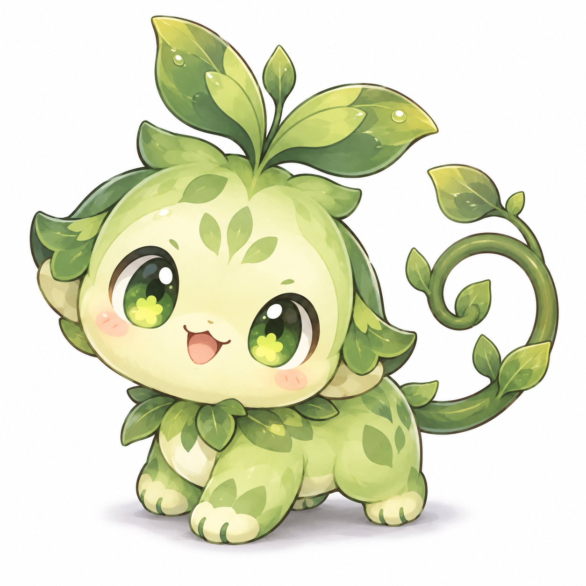
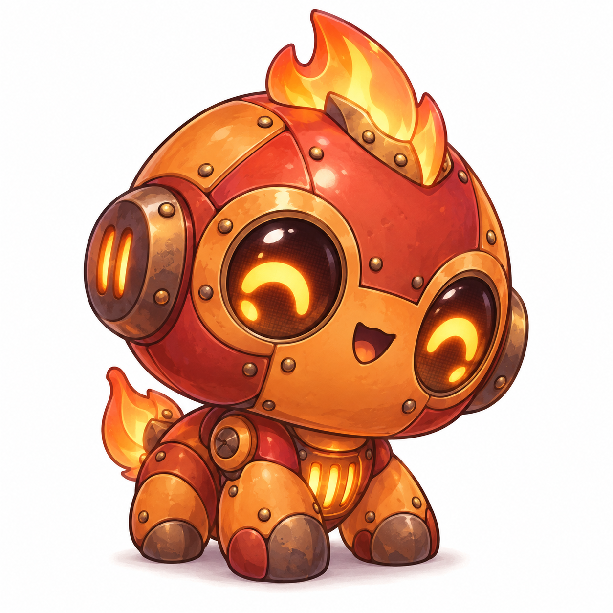
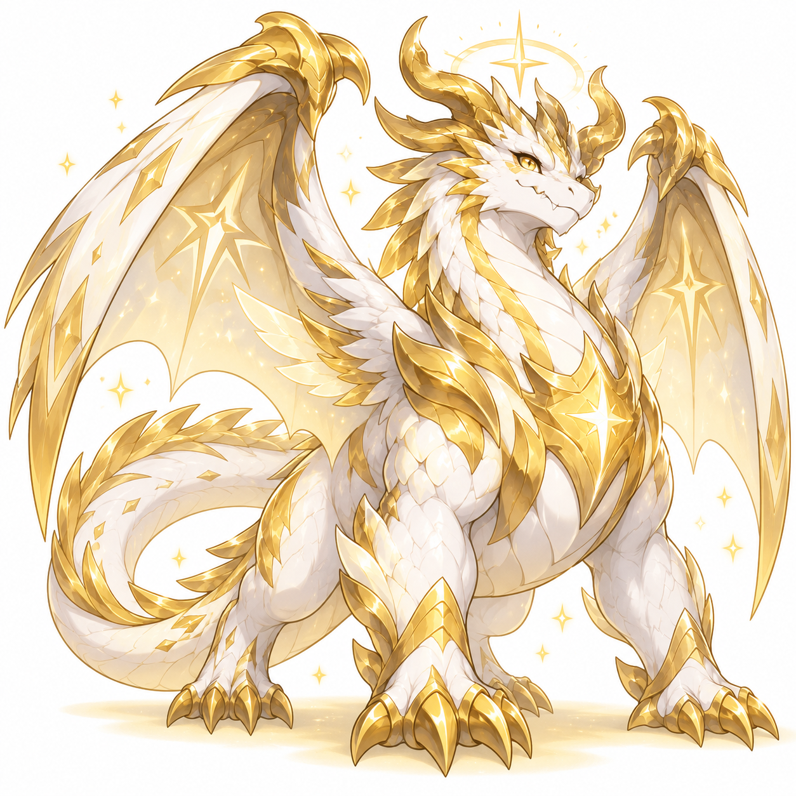

# Notebook Pets · Notebuddy

[한국어](README.md) · **English**

Version **0.2.0**

> An AI companion born in a notebook — a monster you care for and raise on Discord.

Notebook Pets is a virtual-pet project where **Python handles the game rules and an AI agent gives the character its voice and story**. Feed your monster, play together, and take walks to build a relationship with your companion.

The repository is named `notebook-pets`; the service name is **Notebuddy (노트버디)**.

<p align="center">
  
  
  
  
</p>

## Game features

| Area | Contents |
| --- | --- |
| Monsters | 9 species × 8 elements: 72 starter combinations |
| Care | Feeding, snacks, play, sleep, intimacy, and satiety |
| Activities | Persistent stat training, walks, HP-based automatic battles, capture, and fleeing |
| Records | Battle records, capture collection, titles, and rankings |
| Progression rules | Stage transitions at levels 31, 51, and 81; level cap of 100 |
| Final evolution | Light branch at intimacy 70 or above; dark branch below 70 |
| Artwork | All 72 stage-one combinations, plus ComfyUI generation tools |

Browse the refreshed showcase in [assets/examples](assets/examples/README.md) and all 72 starter combinations in `assets/samples/`.

## Architecture and principles

```text
Discord message
    ↓
AI agent / Python tools or MCP        ← Hermes or another host
    ↓ command and authenticated sender ID
Python game engine
    ├─ reads rules from game_data.json
    ├─ evaluates state, cooldowns, and battles
    └─ writes state/{user_id}.json
    ↓ JSON result
Agent replies in the monster's voice

Image-generation tool → local ComfyUI → PNG file
```

- **Separate rules from expression:** the agent is intended to narrate engine results rather than invent game outcomes.
- **Persist state in files:** per-user JSON, rather than conversational memory, is the source of game state.
- **Keep balance in data:** species, elements, matchups, XP thresholds, and action limits live in `data/game_data.json`.
- **Speak as the character:** the connected agent provides the monster's first-person persona. That configuration is not included here.

Species selection, encounters, and battles use randomness governed by the game rules.

## Quick start

### Requirements

- Verified with Python 3.12.
- The engine and current tests use only the Python standard library. No `pip install` is needed for this path.
- Discord, Hermes, ComfyUI, and LLM API keys are not required to try the basic CLI.

Run these commands from the repository root:

```bash
git clone https://github.com/kdkrkwhr/notebook-pets.git
cd notebook-pets

# Help takes no user ID
python -X utf8 engine/engine.py help

# Creates a demo save at state/123456789012345678.json
python -X utf8 engine/engine.py 123456789012345678 start Buddy
python -X utf8 engine/engine.py 123456789012345678 status
python -X utf8 engine/engine.py 123456789012345678 밥줘
python -X utf8 engine/engine.py 123456789012345678 walk

# Rankings also take no user ID
python -X utf8 engine/engine.py rank
```

Starting again with the same ID returns an existing-monster response. These commands create and modify a save file, so use a demo ID distinct from real users. Commands and decay jobs using the same store are serialized with a file lock.

Successful commands and handled game errors print JSON containing `ok` and `msg`. Messages are currently in Korean, and additional fields vary by command.

## Commands

The general format is below. Do not pass Discord's `!` prefix directly to the engine.

```text
python -X utf8 engine/engine.py <user_id> <command> [arguments...]
```

| Action | CLI command / alias |
| --- | --- |
| Create a monster | `start <name>` / `공책시작 <name>` |
| View status | `status` / `상태` |
| Feed / give a snack | `feed` / `밥줘`, `snack` / `간식줘` |
| Play / sleep | `play` / `놀아줘`, `sleep` / `재워줘` / `잘자` |
| Train / walk | `train` / `훈련`, `walk` / `산책` |
| Battle / capture / flee | `battle` / `배틀`, `catch` / `포획`, `flee` / `도망` |
| Daily attendance (XP + 3 normal feed) | `attendance` / `출석` |
| Collection / titles | `pokedex` / `도감`, `titles` / `칭호` |
| Rankings | `python -X utf8 engine/engine.py rank` or `랭킹` — omit the ID |
| Help | `python -X utf8 engine/engine.py help` or `도움말` — omit the ID |

Resolve a wild encounter by battling, capturing, or fleeing before walking again. Use `status` to inspect the current encounter. Automatic battles start at full HP and last up to 20 rounds; HP, attack, and defense training all contribute. Simultaneous knockouts are draws.

Daily limits reset at midnight in Korea (KST); sleep grants an XP bonus for the following calendar day. Attendance provides three normal feed once per day. When owner access is enabled, rankings also require an allowed user ID.

### Administrator and owner settings

Set `NOTEBOOK_ADMIN_IDS` to comma-separated administrator IDs. By default, no administrators are configured.

```powershell
# PowerShell example — replace with the actual administrator's Discord ID
$env:NOTEBOOK_ADMIN_IDS = "123456789012345678"
python -X utf8 engine/engine.py 123456789012345678 owner 987654321098765432 Player
python -X utf8 engine/engine.py 123456789012345678 clearowner
```

- `owner <target_id> [name]`: restricts **this entire deployment** to the designated owner and administrators. It does not assign ownership of an individual user's monster.
- `clearowner`: removes the owner restriction.
- `reset <target_id> [new_name]`: deletes the target save. If the new name has at least two characters, a new monster is created.

Settings are stored in the Git-ignored `data/access.json`. The CLI does not authenticate callers: the integration must supply the real sender ID. IDs must be positive integer strings of 1–20 ASCII digits. See the [runtime integration guide](docs/INTEGRATION.md) for agent integration and storage settings.

## Discord and image integration

### Discord / Hermes

Other AI agents can use the shared Python tool or optional stdio MCP server with the same actor binding and event deduplication. See [AI agent integration](docs/AGENT_INTEGRATION.md) for setup and examples.

Use the existing Hermes profile/routing skill or the optional standalone gateway in `tools/discord_bot.py`. The gateway replies with the game result first, then edits that message to attach the image. See the [image and Discord setup guide](docs/IMAGES.md) for installation and configuration.

Reconnecting it requires Discord bot configuration, sender identification, command routing, a character persona, and image delivery. Manage tokens and administrator permissions outside the repository. See the [operations manual](docs/MANUAL.md) and [harness notes](docs/HARNESS.md), but do not treat their historical local paths, profile names, or cron IDs as current configuration.

### Image generation (optional)

Using the existing PNGs does not require ComfyUI. To generate new artwork, provide:

- ComfyUI running at `http://127.0.0.1:8188`.
- The `DreamShaper_8_pruned.safetensors` checkpoint named in `tools/sd15_txt2img.json`, or a compatible model explicitly configured in that workflow.

```bash
python -X utf8 tools/gen_image.py plant nature sprout samples/demo_plant.png 42
python -X utf8 tools/prerender_all.py --stage 1
```

The first command writes `assets/samples/demo_plant.png`. The second skips starter images that already exist. The bot and CLI share `data/image_prompts.json`, and evolution uses the previous image as a reference. Artwork is cached per pet. Check the server with `python tools/check_images.py`; render an existing pet with `python tools/render_pet.py <user_id>`.

Compare plant, machine, ghost and dragon growth and final light/dark branches in the [evolution gallery](assets/anchored_evolution/index.html). Evolution references each pet's original appearance while changing body proportions at maturity. Open the HTML locally to filter by species and inspect full-size images.

## Repository layout

```text
engine/engine.py           Game CLI and rule processing
data/game_data.json       Balance data
data/prompt_templates.md  Image-prompt reference
state/                    User saves (JSON files are Git-ignored)
assets/samples/           Starter artwork and extra samples
assets/samples_hd/        Selected high-resolution samples
tools/gen_image.py        ComfyUI image generator
tools/prerender_all.py    Batch generation for combinations
tools/preview_roll.py     Random species/element preview
tools/daily_decay.py      Inactivity decay batch
tools/upscale_images.py  Image upscaling tool
tests/test_engine.py      Engine self-checks
promo/index.html         Static promotional page
docs/                    Historical design and operations notes
```

Preserve and back up `state/` and, when used, `data/access.json` separately during deployment.

## Verification

```bash
python -B -X utf8 tests/test_engine.py
python -B -X utf8 -m unittest discover -s tests -p "test_*.py" -v
```

Tests cover species bonuses, XP and evolution, sleep, access control, storage failures, concurrent processes, message replay, training, and combat calculations. Test data is stored in temporary files.

## Design and operations notes

The linked documents are currently in Korean:

- [Game plan](docs/PLAN.md): initial design and planned features
- [Operations manual](docs/MANUAL.md): installation and operating notes for the earlier environment
- [Discord harness](docs/HARNESS.md): agent-mediated integration
- [Image prompts](data/prompt_templates.md): species and element references

Adjust paths and profile settings in the operations notes to match your environment.
