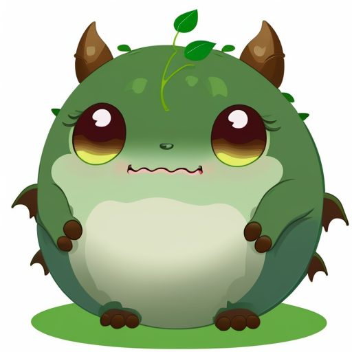
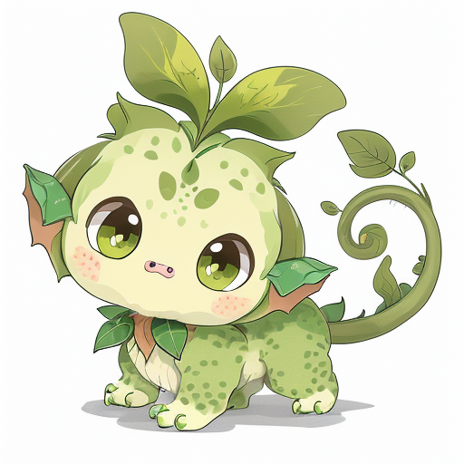

# Local ComfyUI samples / 로컬 생성 예시

채팅 도구의 대표 이미지와 구분한 **실제 로컬 ComfyUI 출력**입니다. DreamShaper 8, 512×512, Euler 20 steps, CFG 8을 사용했습니다.

| 신규 생성 / Text-to-image | 이전 이미지 참조 / Evolution reference |
| --- | --- |
|  |  |

왼쪽은 공통 프롬프트로 생성한 독립 1단계 예시(seed 42)입니다. 오른쪽의 참조 원본은 왼쪽이 아니라 [기존 식물 예시](../examples/plant_nature_stage1.png)입니다. 오른쪽은 임시 게임에서 31레벨로 진화시킨 뒤 실제 `ImageService`로 생성했으며, denoise 0.4를 사용했습니다. 생성 후 같은 요청의 캐시 재사용과 게임 상태 불변도 확인했습니다. 시드와 요청은 옆 JSON에 기록되어 있습니다.

원본의 색상과 잎·꼬리 모티프는 이어지지만, 진화 단계의 체형 차이는 작습니다. 이 자료는 실행 경로를 검증한 출력이며 모든 종족·단계의 아트 품질을 승인했다는 뜻은 아닙니다.

These are real local ComfyUI outputs, separate from the chat-generated showcase. The left image uses the common starter prompt at seed 42. The right image references the existing curated plant example, **not the left image**. It was generated through the game's image service after reaching level 31 in an isolated test save. Cache reuse and unchanged game state were checked. Identity motifs carry over, but the growth silhouette changes only slightly; these samples demonstrate integration rather than approval of every combination's art quality.

Model: [Lykon DreamShaper](https://huggingface.co/Lykon/DreamShaper), `DreamShaper_8_pruned.safetensors`.
